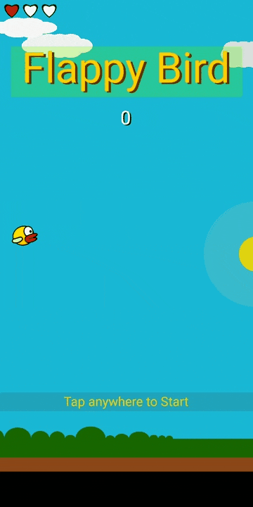

# Flappy-Bird-Processing
Flappy bird clone (with lives and day night cycle).

## Prerequisite
1. [Processing 3](https://processing.org/)

## Running
1. Open `main/main.pde` using Processing
2. Press Run or `ctrl+R`

## How to Play
- Tap anywhere to jupmp
- Don't touch pillars, don't touch the ground

## Acknowledgement
This is my first game using processing. No prior java knowledge. Made in 2017.
